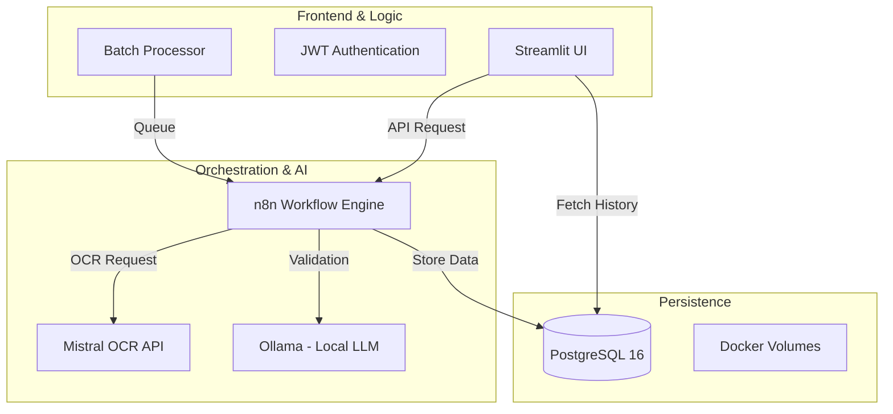
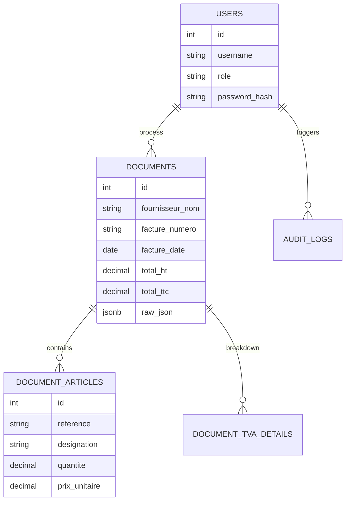
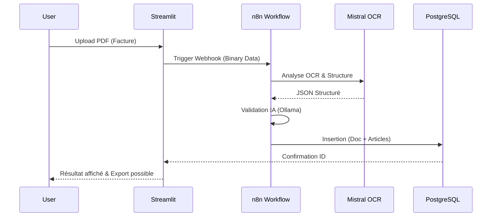

# 📄 Rapport d'Avancement : Projet DocuFlow AI
**Objet :** Système Intelligent de Traitement et d'Extraction de Documents Commerciaux  
**Date :** 05 Avril 2026  
**Rôle :** Expert Solution Architect / Lead Developer  

---

## 1. 📂 Résumé Exécutif
Le projet **DocuFlow AI** est une solution complète de "Document AI" conçue pour automatiser l'extraction de données structurées à partir de factures et documents commerciaux. L'architecture repose sur une approche hybride combinant l'OCR de pointe (**Mistral OCR**), l'orchestration de workflows (**n8n**), et une interface utilisateur réactive (**Streamlit**), le tout conteneurisé sous **Docker** pour une portabilité maximale.

---

## 2. 🏗️ Architecture Globale du Système
Le système est divisé en plusieurs couches interconnectées permettant un flux de données fluide et sécurisé.

### Schéma Architectural (Multi-Container)

---

## 3. 🛠️ Stack Technologique (Expertise)

| Composant | Technologie | Justification Technique |
| :--- | :--- | :--- |
| **Interface** | `Streamlit` | Développement rapide de dashboards data-centric et gestion d'état réactive. |
| **Orchestration** | `n8n` | Low-code workflow permettant une flexibilité totale dans l'enchaînement des étapes de traitement. |
| **Extraction AI** | `Mistral OCR` | Précision inégalée pour la lecture de tableaux complexes et de documents manuscrits/scannés. |
| **Validation AI** | `Ollama (Mistral/Llama)` | Utilisation de LLM locaux pour valider la cohérence des données sans sortir du réseau (Privacy). |
| **Base de Données** | `PostgreSQL 16` | Robustesse, support natif du JSONB pour les métadonnées IA et intégrité référentielle. |
| **Containers** | `Docker / Compose` | Isolation des services, gestion des dépendances et déploiement reproductible. |
| **Export** | `FPDF2 / Pandas` | Génération de rapports PDF et fichiers Excel structurés. |

---

## 4. ⚙️ Détails des Réalisations (Ce qu'on a fait précisément)

### A. Pipeline d'Extraction "Fine-Tuned"
Nous avons implémenté un pipeline capable non seulement d'extraire les métadonnées de base (vendeur, date, total), mais aussi de segmenter précisément le **corps de la facture** :
- **Référence Article** : Capture du code produit interne.
- **Désignation** : Libellé complet de l'article.
- **Quantité & PU** : Extraction numérique avec nettoyage automatique des caractères non-monétaires.
- **Mapping TVA** : Calcul automatique et vérification des taux appliqués.

### B. Moteur d'Authentification & Sécurité
- Mise en place d'un système robuste basé sur **JWT (JSON Web Tokens)**.
- Hachage des mots de passe via **Bcrypt**.
- Gestion des rôles : `Admin` (Gestion totale), `Comptable` (Extraction & Export), `Lecteur` (Consultation seule).

### C. Dashboard Analytique & Historique
- Visualisation en temps réel de la consommation via Plotly.
- Historique filtrable avec fonction de recherche "Full Text" sur le nom du fournisseur et le numéro de facture.
- Système de **reprise sur erreur** (Dead Letter Queue) pour les documents mal formés.

---

## 5. 📊 Modèle de Données (Entity-Relationship)
Le schéma a été optimisé pour la performance avec des index stratégiques sur les colonnes de recherche fréquentes.

---

## 6. 🔄 Workflow de Traitement (Séquence)
Voici le parcours exact d'un document une fois uploadé :

---

## 7. 🚀 Conclusion & Perspectives
Le système est actuellement **100% opérationnel** en environnement Dockeré. Les prochaines étapes envisagées sont :
1. **Apprentissage Actif** : Permettre à l'utilisateur de corriger les données pour "ré-entraîner" le prompt de validation.
2. **Multi-Langues** : Extension de l'extraction aux documents en Arabe et autres langues régionales.
3. **Intégration ERP** : Export automatique vers des solutions comme SAP, Odoo ou Sage via API.

---
**Rédigé par :** L'équipe DocuFlow AI  
**Support Technique :** Antigravity AI Assistant
